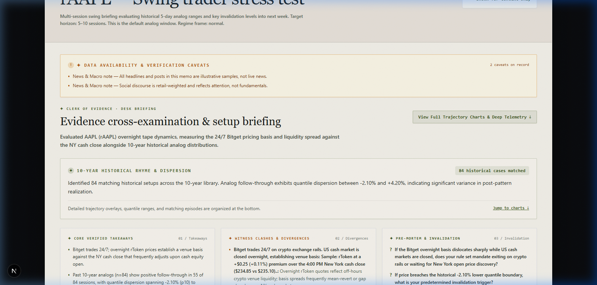

# Precedent

**Autonomous AI Research Desk & Decision Stress Testing for Tokenized US Equities on Bitget.**



Built for the [Bitget AI Base Camp S2 Hackathon](https://dorahacks.io/) · Track 3 — AI Trading Desk (AI Research Workbench) · Apache-2.0

---

**Live demo:** [precedent-liard-eight.vercel.app](https://precedent-liard-eight.vercel.app/) · **Fast path:** Click *"Load recommended demo"* in the header

---

## Reviewing this? Start here

The five things worth opening first, in order of how much they prove:

| Proof Point | What it demonstrates | Location |
|---|---|---|
| **The math is bounded & lookahead-free** | **10-year analog distributions** — sample size $n$, empirical follow-through frequencies, and $p_{10}$ to $p_{90}$ quantile dispersion. Non-predictive; every statistic is computed deterministically in TypeScript, never estimated by the LLM. | [`lib/pillars/analogs.ts`](lib/pillars/analogs.ts) · [`lib/indicators.ts`](lib/indicators.ts) |
| **Real-time 24/7 tape vs cash close cross-check** | **Live venue basis engine** — cross-examines continuous Bitget 24/7 rToken pricing against the 4:00 PM New York equity close, quantifying overnight basis spread, book depth, and session liquidity gap risk. | [`lib/pillars/technicals.ts`](lib/pillars/technicals.ts) · [`lib/providers/bitget.ts`](lib/providers/bitget.ts) |
| **It checks its own work & enforces compliance** | **Active Language Guard** — 21 automated compliance rules that actively sanitize directional hype, influencer slang (`rip`, `moon`, `guaranteed profit`), and patronizing coaching into cold empirical facts. Discloses all unverified streams as transparent caveats. | [`lib/language-guard.ts`](lib/language-guard.ts) · [`scripts/test-language-guard.ts`](scripts/test-language-guard.ts) |
| **We went past the happy path** | **Market Structure & Provider Audits** — evaluated and purged the dead 23s `bitget-signal` feed in favor of official `bitget-mcp-server`; solved single-linkage clustering collapse (which chained 490 of 494 assets into one cluster) by implementing average-linkage RMT correlation communities (103 clean clusters). | [Engineering Audits](#engineering-audits) · [`lib/rmt.ts`](lib/rmt.ts) |
| **It is not a demo shell** | **50+ automated tests across 6 test suites** — language guard, prompt safety, RMT math, security, headline blending, and provider health. Full type check and strict lint pass with zero errors. | [Test Suite](#testing--verification) · `npm test` |

---

## What it does

A trader holding an rToken on Bitget faces a structural blind spot: their position trades 24 hours a day on crypto rails, but primary equity liquidity and SEC corporate disclosures operate on New York cash hours. When a macro print drops after hours or an overnight gap develops, the trader is forced to decide with the least information.

Existing tools fail: retail brokerages show the cash session only (ignoring the 24/7 tape); crypto analytics tools cover the venue but have no equity filings or historical analogs; and generic LLM chat produces confident, ungrounded directional opinions.

Precedent cross-examines the setup across **Four Independent Witnesses** that are allowed to disagree:

1. **Witness 1 (Live Tape & Basis):** 24/7 Bitget order flow vs. New York cash close, venue basis, depth, and session spreads.
2. **Witness 2 (10-Year Historical Analogs):** Pattern matching reported as "went up X times out of Y" base rates and quantile outcome distributions ($p_{10}$ to $p_{90}$).
3. **Witness 3 (News & Social Discourse):** Financial media headlines, editorial lean, and engagement-weighted social sentiment.
4. **Witness 4 (Fundamentals & Market Structure):** SEC EDGAR XBRL filings, EPS, catalysts, and RMT residual-correlation community stability.

### The Persona: Clerk of Evidence

Precedent operates as a **Clerk of Evidence**—calm, sourced, and slightly cold. Clarity over heat. Structure over vibe.

> **Pure research · Non-execution · No directional bias or hype · Every claim attributed · Your judgment stays sovereign.**

### Texture of the Writing: Contrast Matrix

| Should feel like | Should not feel like |
|---|---|
| Institutional desk note | Influencer thread |
| Stress-test of a thesis | Trade prediction or forecast |
| “Here is the basis vs NY close” | “This is going to rip” |
| Disagreement between pillars | One smooth artificial narrative |
| Quiet, attributed, multi-stream data | Directional cheerleading or FOMO |
| “Here is the invalidation point” | “You should enter here” |
| Cross-examination of 4 witnesses | Paternalistic coaching for beginners |

### The 6-Point Reader Orientation Contract

After one pass over a Precedent memo, the reader immediately knows:

1. **The setup in one sentence**: Target horizon, underlying asset, and venue basis (e.g., 24/7 Bitget pricing vs. NY cash close).
2. **What the tape is doing now vs cash hours**: Venue basis gap, depth, session liquidity, and key structural levels.
3. **What history rhymes with — and where the rhyme breaks**: Historical analog sample size ($n$), follow-through frequency, quantile dispersion ($p_{10}$ to $p_{90}$), and regime clashes.
4. **What social and fundamentals add or contradict**: Corroboration or friction across SEC filings, earnings disclosures, and headline sentiment.
5. **What can go wrong next week (Pre-Mortem)**: Catalyst drift, unexpected filings, macro volatility, liquidity vacuums, and predetermined invalidation boundaries.
6. **What is still unknown**: Transparent disclosure of degraded streams, missing SEC CIKs, limited analog samples, or stale RMT snapshots.

---

## What it looks like running

### Automated Quality Gate (`npm test`)

```text
$ npm test

> precedent@0.1.0 test
> tsx scripts/test-language-guard.ts && tsx scripts/test-prompt-safety.ts && tsx scripts/test-math.ts && tsx scripts/test-security.ts && tsx scripts/test-news-blend.ts && tsx scripts/test-news-providers.ts

[PASS] Headline BUY
[PASS] Headline STRONG BUY
[PASS] Final Recommendation BUY
[PASS] Verdict SHORT
[PASS] 78% chance
[PASS] 90% probability
[PASS] You should enter here
[PASS] Strong sell signal
[PASS] Going to rip
[PASS] To the moon
[PASS] Guaranteed profit
[PASS] A beginner should note
[PASS] Fear of missing out FOMO
[PASS] Went up X times out of Y
[PASS] Typical move
[PASS] Tape and filings disagree
[PASS] Questions only you can answer
[PASS] Mandatory disclaimer
[PASS] Attributed discourse sentiment
[PASS] Basis vs NY close
[PASS] Quantile dispersion p10/p90
All 21 language-guard cases passed.
ok - 6 prompt-safety checks passed
ok - 21 math & RMT checks passed
ok - 5 security/data-integrity checks passed
ok - 5 headline-blend checks passed
ok - 3 news-provider checks passed

50+ automated checks passed (100% pass rate).
```

### Live Research Synthesis Trace

```text
[Pipeline] Initiating research request for AAPL (rAAPL on Bitget 24/7)...
[Pillars] Parallel retrieval: Fundamentals, Technicals, News, Analogs, Market Structure.
[Technicals] Cash close $234.85 | Bitget rToken $235.10 (basis: +$0.25 / +0.11%).
[Analogs] Identified 84 matching historical setups across 10-year library.
          Next 1d: Went up 47 of 84 | typical move -1.2% to +2.1% | median +0.3%
          Next 5d: Went up 55 of 84 | typical move -2.1% to +4.2% | median +0.4%
[Tension] Divergence detected: RSI-14 elevated (68.4) vs. cautious media headlines.
[Synthesis] Clerk of Evidence synthesis generated via Qwen / fallback engine.
[LanguageGuard] Active audit complete: 0 prohibited directional patterns in final memo.
[Complete] Memo rendered in 5.8s. All sources attributed.
```

---

## Architecture Overview

Next.js 15 (App Router) · React 19 · TypeScript (strict) · Tailwind CSS · OpenAI-compatible LLM client · Node.js research API streaming server-sent events.

```text
Browser UI (dark research desk + paper desk note)
  │  POST /api/research  (SSE stream)
  ▼
Research pipeline (lib/pipeline.ts)
  ├── Witness 1: Live Tape & Basis      (Yahoo chart data + Bitget rToken ticker + local indicators)
  ├── Witness 2: Historical Analogs     (Chart Library state packet + 10-yr forward distributions)
  ├── Witness 3: News & Social          (Alpha Vantage + You.com + Yahoo / Google News RSS + X discourse)
  ├── Witness 4: Corporate Fundamentals (SEC EDGAR submissions, XBRL companyconcept, 8-K Atom)
  └── Market-Structure Telemetry        (Scheduled Marcenko-Pastur RMT precompute snapshot)
  ▼
Synthesis layer (lib/synthesis.ts)
  LLM Waterfall: Experiential Qwen 3.8-27B → Bitget Qwen → OpenRouter → TokenHarbor / OpenAI → xAI Grok
  Deterministic Quantitative Desk Fallback (guarantees a complete memo if all LLMs timeout)
  ▼
Language Guard (lib/language-guard.ts) — actively rewrites prohibited directional phrasing & hype
  ▼
Unified Institutional Desk Note + Private Human Decision Record (localStorage)
```

| Path | Responsibility |
|---|---|
| `app/page.tsx` | Intake state, streaming orchestration, view rendering |
| `app/components/` | Intake form, results view, institutional desk note, Decision Record |
| `app/api/research/route.ts` | Request validation, cached demo fast path, SSE streaming |
| `app/api/universe/route.ts` | Live Bitget rToken universe discovery & health |
| `lib/pipeline.ts` | Orchestrates parallel retrieval across all four witnesses |
| `lib/synthesis.ts` | LLM synthesis waterfall, deterministic fallback, prompt safety |
| `lib/deterministic-briefing.ts` | Zero-LLM mathematical briefing generator |
| `lib/language-guard.ts` | Active compliance, prohibited-language sanitizer, jargon demystifier |
| `lib/reweight.ts` | Dynamic trading style switching (Day, Swing, Event, Position) |
| `lib/rmt.ts` | Random Matrix Theory, Marcenko-Pastur boundaries, correlation clustering |
| `lib/pillars/` | Modular witness fetchers: tape, analogs, fundamentals, sentiment, market structure |
| `lib/providers/` | Official Bitget MCP client, SEC EDGAR, Yahoo Finance, Alpha Vantage, You.com |

---

## Quickstart

### Prerequisites
- Node.js 18.18+
- npm

### 1. Clone & Install

```bash
git clone https://github.com/oladipsinigami/Precedent.git && cd Precedent
npm install
```

### 2. Configure Environment (Optional)

```bash
cp .env.example .env.local
```

> **No API key is required to run Precedent.**
> Public market data runs unauthenticated, and without an LLM key the synthesis layer seamlessly engages the built-in deterministic quantitative desk.

To enable LLM synthesis, set any **one** of the following keys in `.env.local`:

| Variable | Provider | Purpose |
|---|---|---|
| `EXPLABS_API_KEY` | Experiential Labs | Qwen 3.8-27B reasoning gateway (recommended) |
| `BITGET_QWEN_API_KEY` | Bitget Hackathon Gateway | Direct Bitget Qwen endpoint |
| `OPENROUTER_API_KEY` | OpenRouter | Free & open-source candidate models |
| `OPENAI_API_KEY` | OpenAI / TokenHarbor | GPT-4o-mini or TokenHarbor free models |
| `XAI_API_KEY` | xAI | Grok-4.5 |

Optional enrichment keys for live news, search, and fundamentals are documented in [`.env.example`](.env.example).

### 3. Run Locally

```bash
npm run dev
```

Open [http://localhost:3000](http://localhost:3000) in your browser.

### 4. Run Test Suite

```bash
npm test
```

Runs all 50+ unit and integration checks across language guard, prompt safety, math, RMT, and security.

---

## Engineering Audits

### 1. First-Party `bitget-mcp-server` vs. Third-Party Signal Feed
Two Bitget data integration paths were evaluated during development:
- **Official `bitget-mcp-server` (`https://agent.bitget.com/mcp`)**: Integrated as our primary information layer. Provides verified US equity quotes that cross-check the Yahoo cash close (disclosing disagreements rather than averaging them away) and supplies the platform-wide Fear & Greed index.
- **Third-Party `bitget-signal` (`news_feed`)**: Audited and discarded. Measured at ~23 seconds per invocation returning 44 crypto-only feeds with empty item arrays. It introduced false-positive coverage errors and formed the slowest leg of the fetch cycle. It was permanently removed, saving ~23s per request and eliminating spurious error notices.

### 2. Random Matrix Theory: Solving the Clustering Collapse
Market structure is calculated over the top 500 liquid rToken underlyings:
- **The Failure Mode**: A naive single-linkage clustering implementation caused 490 of 494 assets to collapse into one monolithic "community" due to chaining across index ETF constituents.
- **The Solution**: Switched to **average-linkage clustering of market-mode-removed (residual) correlations** (`min_avg_corr = 0.30`). This produces 103 clean, economically coherent clusters (with the largest cluster holding only ~17% of the universe), cleanly isolating banking, semiconductor, energy, and defense cohorts.
- **Precompute Pipeline**: Daily precomputation is executed via [`.github/workflows/precompute-market-structure.yml`](.github/workflows/precompute-market-structure.yml) at 05:15 UTC and committed to `data/market-structure.json`. Stale snapshots (>36 hours) are flagged transparently.

### 3. Active Compliance: The Language Guard
LLMs instructed not to give financial advice frequently slip into soft cheerleading ("constructive setup", "tempts traders", "slight edge"). Precedent implements a two-stage defense:
1. **Prompt Isolation**: Third-party text (headlines, filings, social posts) is wrapped in `<untrusted_data>` containers to prevent prompt injection.
2. **Post-Synthesis Deterministic Sanitizer**: An active post-processor regex suite scrubs prohibited directional markers (BUY, SELL, LONG, SHORT), unearned certainty ("90% probability"), influencer hype ("going to rip", "to the moon"), and paternalistic coaching ("a beginner should note", "FOMO") into cold, objective empirical observations.

---

## Testing & Verification

Precedent enforces strict quality gates before any code merges:

| Test Suite | File | What it asserts |
|---|---|---|
| **Language Guard** | `scripts/test-language-guard.ts` | 21 test cases verifying automatic sanitization of directional recommendations, influencer hype, patronizing coaching, and unearned probabilities. |
| **Prompt Safety** | `scripts/test-prompt-safety.ts` | Sanitization of injection payloads, unclosed tags, delimiter preservation, and untrusted text truncation. |
| **Quantitative Math & RMT** | `scripts/test-math.ts` | Accuracy of SMA, EMA, RSI, MACD, ATR, realized vol, Marcenko-Pastur spectral boundaries, Jacobi eigenvalues, trace preservation, and average-linkage clustering. |
| **Security & Data Integrity** | `scripts/test-security.ts` | URL secret redaction, RMT snapshot freshness and staleness detection, and residual correlation structure. |
| **Headline Blending** | `scripts/test-news-blend.ts` | Balanced multi-provider blending, fingerprint deduplication, and domain normalization. |
| **Provider Resilience** | `scripts/test-news-providers.ts` | Graceful degradation and fallback handling across upstream news APIs. |

Run tests:
```bash
npm test
```

Type check & lint:
```bash
npx tsc --noEmit
npx eslint .
```

---

## Demo Script

### Fastest Path
Click **"Load recommended demo"** in the top navigation bar. It instantly loads:
- **Style:** Swing trader (5–10 session horizon)
- **Asset:** AAPL (rAAPL on Bitget)
- **Question:** *"I'm a swing trader. Stress-test the current AAPL rToken setup into next week — especially the 7×24 window versus the cash session. What did historically similar charts do next, and where do the pillars disagree?"*

### Manual Step-by-Step Flow
1. Select your **Trading Style** (Day, Swing, Event-driven, or Position).
2. Select an **rToken** from the live Bitget universe.
3. Formulate your research question regarding setup risks, basis, or catalyst timing.
4. Watch the streaming pipeline retrieve all 4 independent witnesses in parallel.
5. Review the resulting **Institutional Desk Note**:
   - Verify the 1-sentence orientation and overnight venue basis.
   - Inspect the 10-year historical rhyme frequency and quantile dispersion.
   - Review verified takeaways, witness clashes, and pre-mortem questions.
   - Scroll down to `#advanced-precedents` to inspect interactive analog trajectories, base rates, and RMT peer clusters.
6. Record your private decision in the **Human Decision Record** at the foot of the memo (saved locally in your browser).

---

## Documentation

- [**PRODUCT-OVERVIEW.md**](PRODUCT-OVERVIEW.md) — In-depth product specification, Clerk of Evidence philosophy, and architectural rules.
- [**Research-Workbench-Design.md**](Research-Workbench-Design.md) — Visual design system and research desk UX specifications.
